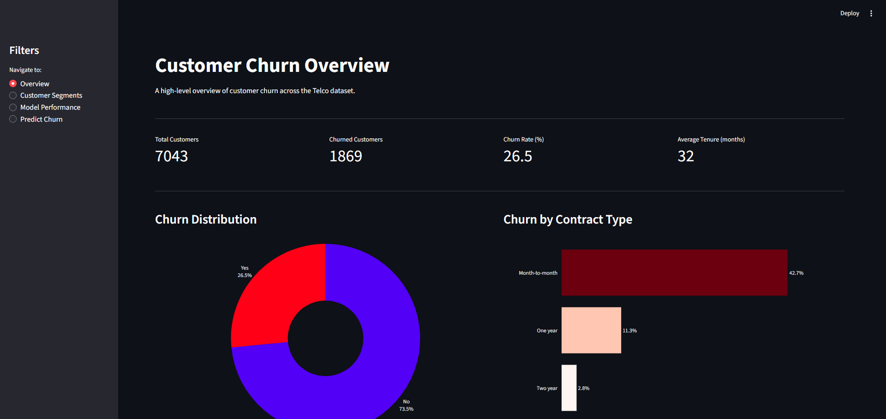

# Customer Churn Prediction Project


## Overview
This project focuses on predicting customer churn for a telecommunications company. The goal is to identify customers who are likely to leave the service, allowing the company to take proactive measures to retain them.

## Objectives
- Analyze factors contributing to customer churn.
- Develop a predictive model to identify customers at risk of churning.
- Evaluate the performance of the model and select the best one for deployment.
- Provide key insights into features that influence customer retention.


## Technologies Used
- **Languages:** Python
- **Data and Machine Learning:** Pandas, NumPy, Scikit-learn, XGBoost, Imbalanced-learn
- **Visualization:** Matplotlib, Seaborn, Plotly
- **Dashboard:** Streamlit
- **Tools:** Jupyter Notebook, Joblib, Git


## Getting Started
### Prerequisites
- Python 3.8 or higher
- pip

### Installation
```bash
git clone https://github.com/yourusername/customer_churn.git
cd customer_churn
pip install -r requirements.txt
```
### Running the Notebooks
Open and run the notebooks in the following order:
1. `notebooks/01_eda.ipynb` - Exploratory Data Analysis
2. `notebooks/02_feature_engineering.ipynb` - Feature Engineering
3. `notebooks/03_modeling.ipynb` - Machine Learning Modeling and Evaluation


## Dataset Description
- Source: [Telco Customer Churn Dataset](https://www.kaggle.com/datasets/blastchar/telco-customer-churn)
- Contains 7,043 customer records with 21 features covering demographics, account information, subscribed services, and churn status.


## Exploratory Data Analysis (EDA)
### Key Questions Addressed:
1. Who is most likely to churn? (e.g., demographics, service usage)
2. What factors contribute most to customer churn? (e.g., contract type, payment method)
3. What is the relationship between pricing and churn? (e.g., monthly charges, total charges)

### Key Insights:
- Customers with shorter tenure are more likely to churn, indicating that newer customers are more likely to leave the service.
- Higher monthly charges are associated with a higher likelihood of churn, suggesting that pricing may be a factor in customer retention.
- Customers on month-to-month contracts with higher monthly charges are more likely to churn, while those on two-year contracts with lower monthly charges are less likely to churn.
- Customers with Fiber optic internet service have a higher churn rate compared to those with DSL or no internet service.
- Customers paying with electronic check have a higher churn rate compared to those using other payment methods.

## Feature Engineering
- Dropped irrelevant feature:
    - customerID: Does not provide predictive value for churn.
- Changed to numeric data types:
    - `TotalCharges`: Converted from object to numeric, handling missing values appropriately.
- Encoded variables:
    - To binary variables:
        - `gender`
        - `Partner`
        - `Dependents`
        - `PhoneService`
        - `PaperlessBilling`
        - `Churn`
    - To categorical variables:
        - `MultipleLines`
        - `InternetService`
        - `OnlineSecurity`
        - `OnlineBackup`
        - `DeviceProtection`
        - `TechSupport`
        - `StreamingTV`
        - `StreamingMovies`
        - `Contract`
        - `PaymentMethod`
- Created new features:
    - `AverageMonthlyCharges`: Calculated as `TotalCharges` divided by `tenure`, providing insight into the average monthly cost for each customer.
    - `HasStreamingServices`: A binary feature indicating whether a customer has any streaming services (TV or Movies), which may influence churn behavior.
    - `NumAddOnServices`: A count of additional services (e.g., OnlineSecurity, OnlineBackup, DeviceProtection, TechSupport, StreamingTV, StreamingMovies) that a customer has subscribed to, which may impact their likelihood to churn.
    - `IsNewCustomer`: A binary feature indicating whether a customer is new (tenure <= 12 months), as new customers may have different churn patterns compared to long-term customers.
- Scaled numerical features:
    - `tenure`
    - `MonthlyCharges`
    - `TotalCharges`
    - `AverageMonthlyCharges`

## Machine Learning Modeling
### Models Used:
- Logistic Regression
- Random Forest
- XGBoost
- Support Vector Machine (SVM)

### Model Evaluation Metrics:
- Accuracy
- Precision
- Recall
- F1 Score
- ROC-AUC Score

### Model Performance:
| Model              | Accuracy | Precision | Recall | F1 Score | ROC-AUC Score |
|--------------------|----------|-----------|--------|----------|---------------|
| Logistic Regression | 0.76    | 0.54      | 0.69   | 0.60     | 0.83          |
| Random Forest       | 0.76    | 0.54      | 0.63   | 0.58     | 0.82          |
| XGBoost             | 0.75    | 0.52      | 0.72   | 0.61     | 0.83          |
| Support Vector Machine (SVM) | 0.76    | 0.53     | 0.69    | 0.60     | 0.82          |

### Model Selection
- XGBoost was selected as the best model based on its performance metrics, particularly its high recall and F1 score
- XGBoost also had high ROC-AUC score, tied with Logistic Regression, indicating good overall performance in distinguishing between churners and non-churners.

### Hyperparameter Tuning
- Performed using RandomizedSearchCV for XGBoost, optimizing parameters such as:
    - `n_estimators`
    - `max_depth`
    - `learning_rate`
    - `subsample`
    - `colsample_bytree`
- First iteration of tuning:
    - Accuracy (0.76): Same as default parameters, indicating that tuning did not improve accuracy.
    - Precision (0.53): Slightly higher than default parameters, suggesting a minor improvement in the model's ability to correctly identify churners.
    - Recall (0.65): Lower than default parameters, indicating that the tuned model is less effective at identifying all actual churners.
    - F1 Score (0.58): Lower than default parameters, suggesting that the balance between precision and recall has worsened after tuning.
    - ROC-AUC Score (0.81): Lower than default parameters, indicating a decrease in the model's ability to distinguish between churners and non-churners after tuning.
- Second iteration of tuning:
    - Accuracy (0.76): Higher than default parameters, indicating that tuning improved the model's overall accuracy.
    - Precision (0.53): Higher than default parameters, suggesting an improvement in the model's ability to correctly identify churners.
    - Recall (0.63): Lower than default parameters, indicating that the tuned model is less effective at identifying all actual churners.
    - F1 Score (0.58): Lower than default parameters, suggesting that the balance between precision and recall has worsened after tuning.
    - ROC-AUC Score (0.82): Lower than default parameters, indicating a decrease in the model's ability to distinguish between churners and non-churners after tuning.

### Final Model Evaluation
The default XGBoost model was selected for deployment over the tuned versions due to its superior recall and F1 score, critical for identifying at-risk customers.

### Feature Importance
- The most important features for predicting customer churn:
    - `Contract_Two year`: Customers on two-year contracts are less likely to churn, making this feature a strong predictor of retention.
    - `PaymentMethod_Electronic check`: Customers paying with electronic checks are more likely to churn, indicating that this payment method may be associated with higher churn rates.
    - `InternetService_Fiber optic`: Customers with fiber optic internet service have a higher likelihood of churning, suggesting that this type of service may be linked to customer dissatisfaction or higher expectations.
    - `Contract_One year`: Customers on one-year contracts are more likely to churn compared to those on two-year contracts, indicating that shorter contract lengths may be associated with higher churn rates.
    - `InternetService_No`: Customers without internet service are less likely to churn, suggesting that having internet service may be associated with higher churn rates, possibly due to dissatisfaction with the service or higher costs.
    - `StreamingMovies_Yes`: Customers with streaming movies service are more likely to churn, indicating that this additional service may not be meeting customer expectations or may be associated with higher costs leading to churn.
    - `tenure`: Customers with shorter tenure are more likely to churn, indicating that newer customers may be at higher risk of leaving the service.
    - `Dependents`, `PhoneService`, `MultipleLines` also contribute to churn prediction, but with less importance compared to the top features.

### Limitations
- Some potential limitations of the project include:
    - The model utilized SMOTE for handling class imbalance, which may not always capture the true distribution of the minority class and could lead to overfitting on synthetic samples.
    - The model was trained on a static (snapshot) dataset, which may not reflect changes in customer behavior or market conditions over time. This could limit the model's ability to generalize to future data.
    - The fairness across demographic groups was not evaluated, which could lead to biased predictions if certain groups are underrepresented in the training data (e.g., `SeniorCitizen`).
    - The feature importance analysis shows the correlation between features and the target variable, but not causation (i.e., it does not prove that certain features cause churn, only that they are associated with it). Further investigation would be needed to establish causal relationships.

## Interactive Dashboard
An interactive dashboard was created using Streamlit to visualize key insights and generate real-time predictions for customer churn.



### Pages:
- **Overview:** Key KPIs, churn distribution, and churn by contract type.
- **Customer Segments:** Churn analysis by internet service, payment method, tenure group, senior citizen status, and dependents.
- **Model Performance:** Model comparison table, ROC curve, confusion matrix, and feature importance chart.
- **Predict Churn:** Real-time churn probability prediction with risk level classification and key risk factor detection.

### Running the Dashboard:
```bash
pip install -r requirements.txt
streamlit run dashboard/app.py
```


## Project Structure
```
customer_churn/
|
├── assets/
|   └── dashboard_overview.png
├── dashboard/
|   └── app.py              # Streamlit dashboard application
├── data/             
│   ├── processed/          # Cleaned and processed datasets
│       ├── X_test.csv
│       ├── X_train.csv
│       ├── y_test.csv
│       └── y_train.csv
|   ├── WA_Fn-UseC_-Telco-Customer-Churn.csv  # Original dataset
├── models/
|   ├── standard_scaler.joblib   # Saved StandardScaler for feature scaling
│   ├── xgboost_model.pkl    # Saved XGBoost model
├── notebooks/
│   ├── 01_eda.ipynb        # Exploratory Data Analysis
│   ├── 02_feature_engineering.ipynb  # Feature engineering steps
│   ├── 03_modeling.ipynb   # Machine learning modeling and evaluation
|
├── README.md              # Project documentation
├── requirements.txt       # Python dependencies
└── .gitignore            # Git ignore file
```

## Conclusion
This project demonstrates an end-to-end machine learning workflow for predicting customer churn, from data exploration and feature engineering to machine learning modeling and evaluation. The insights gained from the feature importance analysis can help the telecommunications company understand key factors influencing customer churn and develop targeted strategies for customer retention. In addition, the project highlights how machine learning can be utilized in real-world business applications to drive data-informed decision-making and improve customer retention strategies.

## Author
**Aaron Thomas**
[GitHub](https://github.com/texanoiler) | [LinkedIn](https://www.linkedin.com/in/aaron-s-thomas/)